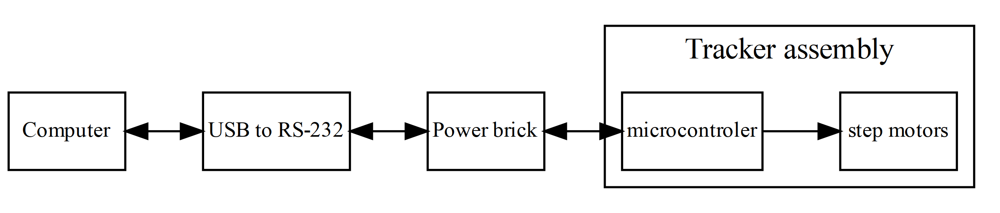
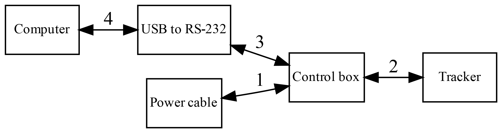

\newpage

# Ο ηλιοστάτης του Εργαστηρίου Φυσικής της Ατμόσφαιρας. {#tracker}

## Περιγραφή tracker (ηλιοστάτη). {#trackerdescription}

Η συσκευή αποτελείται από σώμα αλουμινίου, δύο άξονες κίνησης, δύο κινητήρες και ηλεκτρονικό σύστημα ελέγχου.
Οι άξονες έχουν ομόκεντρα γρανάζια τα οποία τίθενται σε κίνηση από stepper motors μέσω κατάλληλου ιμάντα (Εικόνα \@ref(fig:trackerinside)).
Η επικοινωνία με το σύστημα ελέγχου γίνεται μέσω σειριακής θύρας (πραγματικής ή εικονικής με τη χρήση μετατροπέα usb/serial).

Και οι δύο κάθετοι άξονες (αζιμούθιου και ζενίθ) έχουν τις ίδιες δυνατότητες και χαρακτηριστικά μεταξύ τους, η λειτουργία τους είναι πανομοιότυπη και μπορούν να κινηθούν ταυτόχρονα και ανεξάρτητα ο ένας από τον άλλο. 

Οι κινητήρες του tracker μπορούν να κινηθούν με σταθερό βήμα $0.6^\circ$ ο καθένας.
Στο πρώτο μοντέλο του ηλιοστάτη, για τη μετάδοση της κίνησης, οι κινητήρες έχουν στο γρανάζι τους 12 δόντια και κινούν μέσω ιμάντα τους άξονες, που έχουν από 70 δόντια ο καθένας. 
Αυτό δίνει την δυνατότητα οι άξονες του ηλιοστάτη να κινούνται με διακριτό βήμα $0.6^\circ \cdot 12 / 70 \simeq 0.10286^\circ$ για το παλιό μοντέλο. Τα καινούρια μοντέλα του ηλιοστάτη, αντίστοιχα έχουν βήμα ${0.125}^\circ$.

Για την εκτέλεση μιας πλήρους περιστροφής του κάθε άξονα ο κινητήρας πρέπει να κάνει $360^\circ / (0.6^\circ \cdot 12 / 70) = 3500$ βήματα στο παλιό μοντέλο και $360^\circ / {0.125}^\circ = 2880$ βήματα στα καινούρια μοντέλα.
Ενώ η μέγιστη ταχύτατα περιστροφής των κινητήρων είναι περίπου μία περιστροφή ανά $15$ δευτερόλεπτα. 

```{r trackerinside, echo=F, fig.cap="Εσωτερικό του παλιού μοντέλου tracker. Φαίνονται τα κύρια γρανάζια των αξόνων, ο κινητήρας του αζιμούθιου άξονα και το ηλεκτρονικό σύστημα ελέγχου, καθώς και το CHP\ 1.", out.width = '50%', fig.env='img'}
knitr::include_graphics("/home/athan/Aerosols/Photos/EL/20160615_Tracker2/20160615_125806.jpg")
```


## Επικοινωνία με τον tracker. {#tracker_communication}

Οι κινητήρες ελέγχονται από μικροελεγκτή (microcontroller), ο οποίος βρίσκεται μέσα στο κύριο σώμα της συσκευής. Ο μικροελεγκτής είναι ήδη προγραμματισμένος να εκτελεί άμεσα τις εντολές που λαμβάνει, μέσω της σειριακής επικοινωνίας.

Το λειτουργικό σύστημα του υπολογιστή αναγνωρίζει τη σειριακή σύνδεση με τον microcontroller ως κάποια θύρα `COM#` στα Windows ή ως `/dev/ttyUSB#`, `/dev/ttyS#` σε GNU/Linux. Οι εντολές μεταδίδονται στη συσκευή, γράφοντάς τις σε κάποια από αυτές τις διευθύνσεις. Αντίστοιχα, οι απαντήσεις των εντολών διαβάζονται από την ίδια διεύθυνση. Τυπικά, η επικοινωνία είναι πανομοιότυπη με την εγγραφή (write) και την ανάγνωση (read) κειμένου (string) από αρχείο, με βήμα, μία γραμμή  ανά εντολή. Κάθε γραμμή τερματίζεται με τον χαρακτήρα `'\r'` (Carriage return, CR).

Η σειριακή επικοινωνία μπορεί να επιτευχθεί με άμεση σύνδεση του μικροελεγκτή σε σειριακή θύρα του υπολογιστή. Είτε, μέσω μετατροπέα USB UART (adapter usb to serial) σε θύρα USB του ηλεκτρονικού υπολογιστή (Σχήμα \@ref(fig:trackercon)). Στην περίπτωσή μας χρησιμοποιούμε τον μετατροπέα 'FT232 USB-Serial (UART) IC'. Υπάρχει το ενδεχόμενο κάποιοι μετατροπείς UART να μην επιτυγχάνουν σωστή επικοινωνία, λόγω των τεχνικών τους χαρακτηριστικών.


```{r echo=F}
system('echo \'
digraph trackercon {

  # Intialization of graph attributes
  graph [align   = center,
         layout  = dot,
         rankdir = LR,
         dpi     = 400]

  # Initialization of node attributes
  node [shape = box,
        fontsize = 10,
        margin = 0.001]

    " Computer " -> " USB to RS-232 " -> " Power brick " -> " microcontroler " [dir="both"]

    subgraph cluster { label="Tracker assembly"
        " microcontroler " -> "step motors"
    }
}
\' > figure/trackercon.dot')
#system('dot -Tpdf graph.dot -o graph.pdf')
system('dot -Tpng figure/trackercon.dot -o figure/trackercon.png')
```
```{r trackercon, echo=F, fig.cap="Διάγραμμα επικοινωνίας του tracker με τον υπολογιστή."}

```

### Επικοινωνία με τον Tracker σε περιβάλλον MatLab {#tracker_matlab}

Σε αυτό το στάδιο περιγράφονται οι εντολές και οι παράμετροι που απαιτούνται προκειμένου να επιτευχθεί επικοινωνία με τον Tracker σε περιβάλλον MatLab. Το MatLab διαθέτει έτοιμες συναρτήσεις και εντολές για την επικοινωνία με ένα Serial Object, με την προϋπόθεση να έχουμε εγκατεστημένο το Instrument Control Toolbox. Προτού ανοίξουμε την σειριακή θύρα, πρέπει να δημιουργηθεί ένα Serial Object χρησιμοποιώντας την εντολή `serial`, εισάγοντας τις αντίστοιχες ρυθμίσεις του Tracker. Στο MatLab snippet που ακολουθεί, ορίζεται μια struct με όνομα 'Tracker', η οποία περιλαμβάνει τόσο τις ρυθμίσεις της σειριακής επικοινωνίας (SerialConfiguration), όσο και αυτό καθαυτό το Serial Object (SerialPort). Σημειώνεται ότι στον συγκεκριμένο κώδικα έχει γίνει hard coding της Communication Port σε `COM4`, καθώς ξέρουμε ότι σε αυτήν την θύρα είναι συνδεδεμένο το καλώδιο USB του Tracker. Για την αυτόματη εύρεση της COM Port μπορεί να χρησιμοποιηθεί η εντολή `instrfindall` που εντοπίζει όλες τις ενεργές συνδέσεις και επιστρέφει τις θύρες COM, στις οποίες βρίσκονται συνδεδεμένες συσκευές.

```Matlab 
% Set Tracker's Serial Port Configuration and create the Serial Object
Tracker.SerialConfiguration.COM             = 'COM4';
Tracker.SerialConfiguration.BaudRate        = 4800;
Tracker.SerialConfiguration.DataBit         = 8;
Tracker.SerialConfiguration.StopBit         = 1;
Tracker.SerialConfiguration.Parity          = 'none';
Tracker.SerialConfiguration.Terminator      = 'CR';
Tracker.SerialConfiguration.Timeout         = 50;
Tracker.SerialConfiguration.InputBufferSize = 5000;

Tracker.SerialPort = serial(Tracker.SerialConfiguration.COM,...
    'BaudRate',Tracker.SerialConfiguration.BaudRate,...
    'DataBit',Tracker.SerialConfiguration.DataBit, ...
    'StopBit',Tracker.SerialConfiguration.StopBit, ...
    'Parity',Tracker.SerialConfiguration.Parity, ...
    'Terminator',Tracker.SerialConfiguration.Terminator, ...
    'Timeout',Tracker.SerialConfiguration.Timeout, ...
    'InputBufferSize',Tracker.SerialConfiguration.InputBufferSize);
```

Η παράμετρος `InputBufferSize` επιτρέπει τον έλεγχο του αριθμού των bytes που μπορούν να κρατηθούν στον buffer του μικροεπεξεργαστή και εφόσον δοθεί μια μεγάλη τιμή (όπως στην περίπτωσή μας, 5000), μπορούμε να δίνουμε εντολές στον Tracker την μία πίσω από την άλλη σε stack. Υπόψιν ότι ο μικροεπεξεργαστής σε αυτήν την περίπτωση θα επιστρέψει ως πρώτη απάντηση το αποτέλεσμα της εντολής που ολοκληρώθηκε πρώτη και στην συνέχεια με την ίδια λογική τις υπόλοιπες. Αφού δημιουργηθεί το Serial Object, χρησιμοποιώντας τις εντολές `fopen` και `fclose` μπορούμε να ανοίξουμε και να κλείσουμε αντίστοιχα την σειριακή θύρα. Με τις εντολές `fprintf` και `fscanf` δίνουμε εντολή στον Tracker και λαμβάνουμε την απάντησή του αντίστοιχα σε μορφή ASCII. Παρακάτω παρουσιάζεται ένα παράδειγμα για την εύρεση της θέσης (step) του Αζιμούθιου άξονα

```Matlab
% Send the Command to the Tracker
fprintf(Tracker.SerialPort, 'AZ?');
```
```Matlab
% Wait for the Tracker's microntroller to fill the buffer (Typically 0.5 sec)
pause(time_delay)
```
```Matlab
% Get the Tracker's answer
[answer, bytes, msg_err] = fscanf(Tracker.SerialPort);
```

Με τις παραπάνω εντολές, ο Tracker θα απαντήσει με την θέση σε βήματα του Αζιμούθιου άξονα (πχ AZ:6000<cr>) στην μεταβλητή `answer`, τον αριθμό των bytes που στάλθηκαν (8 στην συγκεκριμένη περίπτωση) στην μεταβλητή `bytes` και τυχόν μηνύματα σφάλματος κατά την σειριακή επικοινωνία στην μεταβλητή `msg_err`. Άλλες χρήσιμες εντολές και παράμετροι για τον έλεγχο και την ορθή επικοινωνία με τον Tracker είναι η `Tracker.SerialPort.BytesAvailable`, η οποία επιστρέφει τον αριθμό των bytes που υπάρχουν διαθέσιμα στον buffer του microcontroller, η `flushinput(Tracker.SerialPort)` και η `flushoutput(Tracker.SerialPort)` που αδειάζουν τον Input και Output buffer αντίστοιχα.


## Σειρά σύνδεσης. {#tracker_connection}

Μετά από δοκιμές όλων των δυνατών συνδυασμών της σειρά σύνδεσης. Διαπιστώσαμε ότι για την επιτυχή επικοινωνία πρέπει να έχει γίνει η σύνδεση (4) και μετά να ακολουθηθεί η σειρά των συνδέσεων (1-2-3) ή (3-2-1) όπως φαίνονται στo Σχήμα \@ref(fig:trackercomm).


```{r echo=F}
system('echo \'
digraph trackercomm {

  # Intialization of graph attributes
  graph [align   = center,
         layout  = dot,
         rankdir = LR,
         dpi     = 400]

  # Initialization of node attributes
  node [shape = box,
        fontsize = 10,
        margin = 0.001]

    " Computer "      -> " USB to RS-232 " [dir="both",label="4"];
    " Power cable "   -> " Control box "   [dir="both",label="1"];
    " USB to RS-232 " -> " Control box "   [dir="both",label="3"];
    " Control box "   -> " Tracker "       [dir="both",label="2"]; 
}
\' > figure/trackercomm.dot')
#system('dot -Tpdf graph.dot -o graph.pdf')
system('dot -Tpng figure/trackercomm.dot -o figure/trackercomm.png')
```
```{r trackercomm, echo=F, fig.cap="Διάγραμμα συνδέσεων του tracker, κατάλληλη σειρά σύνδεσης (1-2-3) ή (3-2-1)."}

```
