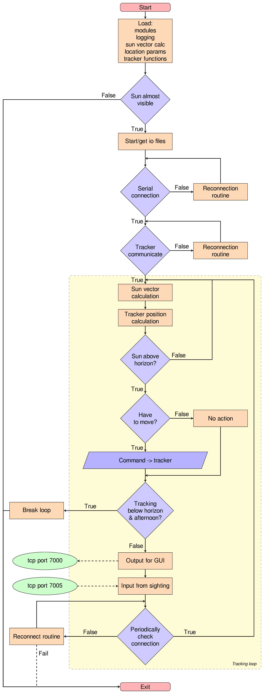
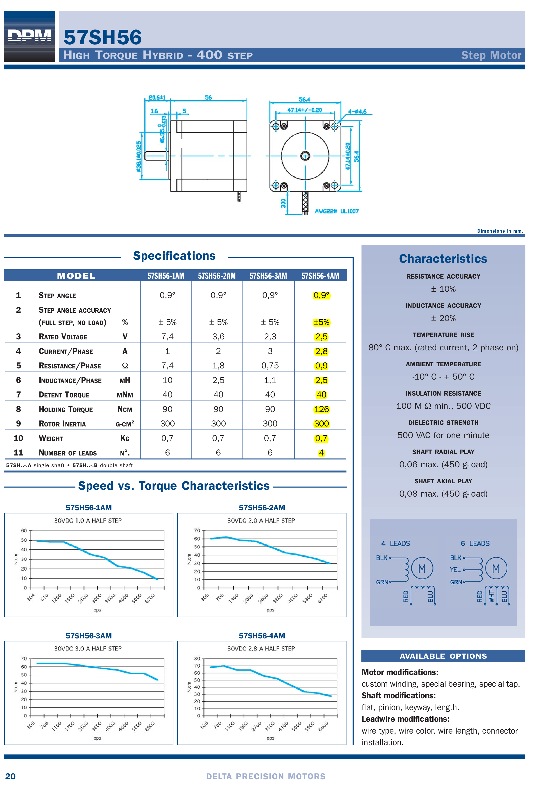

\newpage

# Ο ηλιοστάτης του Εργαστηρίου Φυσικής της Ατμόσφαιρας. {#tracker}

## Περιγραφή tracker (ηλιοστάτη). {#trackerdescription}

Η συσκευή αποτελείται από σώμα αλουμινίου, δύο άξονες κίνησης, δύο κινητήρες και
ηλεκτρονικό σύστημα ελέγχου.  Οι άξονες έχουν ομόκεντρα γρανάζια τα οποία τίθενται σε
κίνηση από stepper motors μέσω κατάλληλου ιμάντα (Εικόνα \@ref(fig:trackerinside)).
Η επικοινωνία με το σύστημα ελέγχου γίνεται μέσω σειριακής θύρας (πραγματικής ή
εικονικής με τη χρήση μετατροπέα usb/serial).

Και οι δύο κάθετοι άξονες (αζιμούθιου και ζενίθ) έχουν τις ίδιες δυνατότητες και
χαρακτηριστικά μεταξύ τους, η λειτουργία τους είναι πανομοιότυπη και μπορούν να
κινηθούν ταυτόχρονα και ανεξάρτητα ο ένας από τον άλλο.

Οι κινητήρες του tracker μπορούν να κινηθούν με σταθερό βήμα $0.6^\circ$ ο καθένας.
Στο πρώτο μοντέλο του ηλιοστάτη, για τη μετάδοση της κίνησης, οι κινητήρες έχουν στο
γρανάζι τους 12 δόντια και κινούν μέσω ιμάντα τους άξονες, που έχουν από 70 δόντια ο
καθένας.  Αυτό δίνει την δυνατότητα οι άξονες του ηλιοστάτη να κινούνται με διακριτό
βήμα $0.6^\circ \cdot 12 / 70 \simeq 0.10286^\circ$ για το παλιό μοντέλο. Τα
καινούρια μοντέλα του ηλιοστάτη, αντίστοιχα έχουν βήμα ${0.125}^\circ$.

Για την εκτέλεση μιας πλήρους περιστροφής του κάθε άξονα ο κινητήρας πρέπει να κάνει
$360^\circ / (0.6^\circ \cdot 12 / 70) = 3500$ βήματα στο παλιό μοντέλο και
$360^\circ / {0.125}^\circ = 2880$ βήματα στα καινούρια μοντέλα.  Ενώ η μέγιστη
ταχύτατα περιστροφής των κινητήρων είναι περίπου μία περιστροφή ανά $15$
δευτερόλεπτα.

```{r trackerinside, echo=F, fig.cap="Εσωτερικό του πρώτου μοντέλου tracker. Φαίνονται τα κύρια γρανάζια των αξόνων, ο κινητήρας του αζιμούθιου άξονα και το ηλεκτρονικό σύστημα ελέγχου, καθώς και το CHP\ 1.", out.width = '50%', fig.env='img'}
knitr::include_graphics("figure/20160615_125806.jpg")
```


## Επικοινωνία με τον tracker. {#tracker_communication}

Οι κινητήρες ελέγχονται από μικροελεγκτή (microcontroller), ο οποίος βρίσκεται μέσα
στο κύριο σώμα της συσκευής. Ο μικροελεγκτής είναι ήδη προγραμματισμένος να εκτελεί
άμεσα τις εντολές που λαμβάνει, μέσω της σειριακής επικοινωνίας.

Το λειτουργικό σύστημα του υπολογιστή αναγνωρίζει τη σειριακή σύνδεση με τον
microcontroller ως κάποια θύρα `COM#` στα Windows ή ως `/dev/ttyUSB#`, `/dev/ttyS#`
σε GNU/Linux. Οι εντολές μεταδίδονται στη συσκευή, γράφοντάς τις σε κάποια από αυτές
τις διευθύνσεις. Αντίστοιχα, οι απαντήσεις των εντολών διαβάζονται από την ίδια
διεύθυνση. Τυπικά, η επικοινωνία είναι πανομοιότυπη με την εγγραφή (write) και την
ανάγνωση (read) κειμένου (string) από αρχείο, με βήμα, μία γραμμή  ανά εντολή. Κάθε
γραμμή τερματίζεται με τον χαρακτήρα `'\r'` (Carriage return, CR).

Η σειριακή επικοινωνία μπορεί να επιτευχθεί με άμεση σύνδεση του μικροελεγκτή σε
σειριακή θύρα του υπολογιστή. Είτε, μέσω μετατροπέα USB UART (adapter usb to serial)
σε θύρα USB του ηλεκτρονικού υπολογιστή (Σχήμα \@ref(fig:trackercon)). Στην περίπτωσή
μας χρησιμοποιούμε τον μετατροπέα 'FT232 USB-Serial (UART) IC'. Υπάρχει το ενδεχόμενο
κάποιοι μετατροπείς UART να μην επιτυγχάνουν σωστή επικοινωνία, λόγω των τεχνικών
τους χαρακτηριστικών.


```{r echo=F, include=F, eval=T}
## create source file of dot image and build it
system('echo \'
digraph trackercon {

  # Initialization of graph attributes
  graph [align   = center,
         layout  = dot,
         rankdir = LR,
         margin  = 0,
         dpi     = 400]

  # Initialization of node attributes
  node [shape = box,
        fontsize = 10,
        margin = 0.001]

    " Computer " -> " USB to RS-232 " -> " Power supply " -> " microcontroller " [dir="both"]

    subgraph cluster { label="Tracker assembly"
        margin = 14;
        " microcontroller " -> "step motors"
    }
}
\' > figure/trackercon.dot')
system('dot -Tpdf figure/trackercon.dot -o figure/trackercon.pdf')
system('dot -Tpng figure/trackercon.dot -o figure/trackercon.png')
```

\begin{figure}[h!]
  \centering
     \includegraphics[width=.90\linewidth]{./figure/trackercon}
  \caption
  [Επικοινωνία ελέγχου ηλιοστάτη]
  {
    Διάγραμμα επικοινωνίας του ηλιοστάτη με τον υπολογιστή ελέγχου.
  }\label{fig:trackercon}
\end{figure}


### Επικοινωνία με τον Tracker σε περιβάλλον MatLab {#tracker_matlab}

Σε αυτό το στάδιο περιγράφονται οι εντολές και οι παράμετροι που απαιτούνται
προκειμένου να επιτευχθεί επικοινωνία με τον Tracker σε περιβάλλον MatLab. Το MatLab
διαθέτει έτοιμες συναρτήσεις και εντολές για την επικοινωνία με ένα Serial Object, με
την προϋπόθεση να έχουμε εγκατεστημένο το Instrument Control Toolbox. Προτού
ανοίξουμε την σειριακή θύρα, πρέπει να δημιουργηθεί ένα Serial Object χρησιμοποιώντας
την εντολή `serial`, εισάγοντας τις αντίστοιχες ρυθμίσεις του Tracker. Στο MatLab
snippet που ακολουθεί, ορίζεται μια struct με όνομα 'Tracker', η οποία περιλαμβάνει
τόσο τις ρυθμίσεις της σειριακής επικοινωνίας (SerialConfiguration), όσο και αυτό
καθαυτό το Serial Object (SerialPort). Σημειώνεται ότι στον συγκεκριμένο κώδικα έχει
γίνει hard coding της Communication Port σε `COM4`, καθώς ξέρουμε ότι σε αυτήν την
θύρα είναι συνδεδεμένο το καλώδιο USB του Tracker. Για την αυτόματη εύρεση της COM
Port μπορεί να χρησιμοποιηθεί η εντολή `instrfindall` που εντοπίζει όλες τις ενεργές
συνδέσεις και επιστρέφει τις θύρες COM, στις οποίες βρίσκονται συνδεδεμένες συσκευές.

```Matlab 
% Set Tracker's Serial Port Configuration and create the Serial Object
Tracker.SerialConfiguration.COM             = 'COM4';
Tracker.SerialConfiguration.BaudRate        = 4800;
Tracker.SerialConfiguration.DataBit         = 8;
Tracker.SerialConfiguration.StopBit         = 1;
Tracker.SerialConfiguration.Parity          = 'none';
Tracker.SerialConfiguration.Terminator      = 'CR';
Tracker.SerialConfiguration.Timeout         = 50;
Tracker.SerialConfiguration.InputBufferSize = 5000;

Tracker.SerialPort = serial(Tracker.SerialConfiguration.COM,...
    'BaudRate',Tracker.SerialConfiguration.BaudRate,...
    'DataBit',Tracker.SerialConfiguration.DataBit, ...
    'StopBit',Tracker.SerialConfiguration.StopBit, ...
    'Parity',Tracker.SerialConfiguration.Parity, ...
    'Terminator',Tracker.SerialConfiguration.Terminator, ...
    'Timeout',Tracker.SerialConfiguration.Timeout, ...
    'InputBufferSize',Tracker.SerialConfiguration.InputBufferSize);
```

Η παράμετρος `InputBufferSize` επιτρέπει τον έλεγχο του αριθμού των bytes που μπορούν
να κρατηθούν στον buffer του μικροεπεξεργαστή και εφόσον δοθεί μια μεγάλη τιμή (όπως
στην περίπτωσή μας, 5000), μπορούμε να δίνουμε εντολές στον Tracker την μία πίσω από
την άλλη σε stack. Υπόψιν ότι ο μικροεπεξεργαστής σε αυτήν την περίπτωση θα
επιστρέψει ως πρώτη απάντηση το αποτέλεσμα της εντολής που ολοκληρώθηκε πρώτη και
στην συνέχεια με την ίδια λογική τις υπόλοιπες. Αφού δημιουργηθεί το Serial Object,
χρησιμοποιώντας τις εντολές `fopen` και `fclose` μπορούμε να ανοίξουμε και να
κλείσουμε αντίστοιχα την σειριακή θύρα. Με τις εντολές `fprintf` και `fscanf` δίνουμε
εντολή στον Tracker και λαμβάνουμε την απάντησή του αντίστοιχα σε μορφή ASCII.
Παρακάτω παρουσιάζεται ένα παράδειγμα για την εύρεση της θέσης (step) του Αζιμούθιου
άξονα

```Matlab
% Send the Command to the Tracker
fprintf(Tracker.SerialPort, 'AZ?');
```
```Matlab
% Wait for the Tracker's microntroller to fill the buffer (Typically 0.5 sec)
pause(time_delay)
```
```Matlab
% Get the Tracker's answer
[answer, bytes, msg_err] = fscanf(Tracker.SerialPort);
```

Με τις παραπάνω εντολές, ο Tracker θα απαντήσει με την θέση σε βήματα του Αζιμούθιου
άξονα (πχ AZ:6000<cr>) στην μεταβλητή `answer`, τον αριθμό των bytes που στάλθηκαν (8
στην συγκεκριμένη περίπτωση) στην μεταβλητή `bytes` και τυχόν μηνύματα σφάλματος κατά
την σειριακή επικοινωνία στην μεταβλητή `msg_err`. Άλλες χρήσιμες εντολές και
παράμετροι για τον έλεγχο και την ορθή επικοινωνία με τον Tracker είναι η
`Tracker.SerialPort.BytesAvailable`, η οποία επιστρέφει τον αριθμό των bytes που
υπάρχουν διαθέσιμα στον buffer του microcontroller, η
`flushinput(Tracker.SerialPort)` και η `flushoutput(Tracker.SerialPort)` που
αδειάζουν τον Input και Output buffer αντίστοιχα.


## Συνδεσμολογία {#tracker_connection}

Έχει διαπιστωθεί εμπειρικά, ότι η σειρά της συνδεσμολογίας του ηλιοστάτη παίζει ρόλο
στην ορθή ενεργοποίηση των επιμέρους στοιχείων και την επιτυχή λειτουργία του
ηλιοστάτη. Για την επιτυχή επικοινωνία, προτείνουμε την αλληλουχία σύνδεσης (1-2-3-4)
ή (1-4-3-2) όπως φαίνεται στο Σχήμα\nobreakspace{}\@ref(fig:trackercomm).

```{r echo=F, include=F, eval=T}
## create source file of dot image and build it
system('echo \'
digraph trackercomm {

  # Initialization of graph attributes
  graph [align   = center,
         layout  = dot,
         rankdir = LR,
         margin  = 0,
         dpi     = 400]

  # Initialization of node attributes
  node [shape = box,
        fontsize = 10,
        margin = 0.001]

    " Computer "      -> " USB to RS-232 " [dir="both",label="1"];
    " Power source "  -> " Power supply "  [dir="both",label="4"];
    " USB to RS-232 " -> " Power supply "  [dir="both",label="2"];
    " Power supply "  -> " Tracker "       [dir="both",label="3"];
}
\' > figure/trackercomm.dot')
system('dot -Tpdf figure/trackercomm.dot -o figure/trackercomm.pdf')
system('dot -Tpng figure/trackercomm.dot -o figure/trackercomm.png')
```

\begin{figure}[h!]
  \centering
     \includegraphics[width=.80\linewidth]{./figure/trackercomm}
  \caption
  [Συνδεσμολογία ηλιοστάτη]
  {
  Διάγραμμα συνδέσεων του ηλιοστάτη. H κατάλληλη αλληλουχία σύνδεσης των στοιχείων
  είναι: (1-2-3-4) ή (1-4-3-2).
  }\label{fig:trackercomm}
\end{figure}


\newpage

# Λειτουργία - Προγραμματισμός tracker. {#trackeroperation}

## Γενικές πληροφορίες

Κατά τη λειτουργία πρέπει να δοθεί προσοχή, διότι δεν υπάρχει μηχανικός περιορισμός
που να αποτρέπει την περιστροφή του άξονα κατά γωνίες μεγαλύτερες του πλήρη κύκλου.
Αυτό μπορεί να προκαλέσει πρόβλημα γιατί το καλώδιο του tracker αλλά και τον οργάνων
μπορεί να τυλιχθούν γύρω από τον άξονα και να καταστραφούν.  Επίσης, σε περίπτωση που
η συσκευή δεν έχει τοποθετηθεί μόνιμα π.χ. σε τρίποδα, μπορεί η περιστροφή να
τραβήξει τα καλώδια και να ρίξει τη συσκευή.

Ο tracker όταν του δοθεί εντολή (reset), θα προσπαθήσει να μηδενίσει τον μετρητή
βήματος αφού μετακινηθεί σε μία γνωστή θέση.  Αυτό γίνεται με την περιστροφή του
άξονα, μέχρι να φτάσει στη συγκεκριμένη θέση, την οποία αναγνωρίζει με μία φωτοδίοδο.
Προσοχή, σε περίπτωση που δεν πάρει σήμα από τη φωτοδίοδο, θα συνεχίσει να
περιστρέφεται ασταμάτητα.  Αυτό μπορεί να συμβεί, αν το καπάκι είναι ανοιχτό σε
έντονο φως ή αν υπάρχει κάποιο πρόβλημα επικοινωνίας με τη φωτοδίοδο.

Ο tracker θα μηδενίσει τον κάθε άξονα στη θέση `'5000'`. Από εκεί και πέρα μπορεί να
κινηθεί και προς τις δύο κατευθύνσεις.  Προσοχή, αν το βήμα γίνει αρνητικό από κάποια
εντολή ή αν γίνει μεγαλύτερο του `'9999'` ο tracker θα κολλήσει και θα συνεχίσει να
περιστρέφεται ασταμάτητα.  Αυτό πρέπει να αποφευχθεί μέσω του προγραμματισμού του.
Μελλοντικά μπορεί να προστεθεί κάποιος μηχανικός ή ηλεκτρικός μηχανισμός περιορισμού.

Εάν το βήμα γίνει ακατάλληλο και ο tracker περιστρέφεται ασταμάτητα, μπορεί να
σταματήσει με την εντολή `'stop'`.  Σε αυτήν την περίπτωση, αν ερωτηθεί για τη θέση
του επιστρέφει την τιμή `'9999'`.

Όταν ο ηλιοστάτης τροφοδοτείται και είναι σε λειτουργία, οι κινητήρες δεν θα
επιτρέψουν την ελεύθερη περιστροφή των αξόνων.  Σε περίπτωση που χρειάζεται να
περιστραφούν ελεύθερα, πρέπει να διακοπεί η τροφοδοσία. **Σημείωση**: για το
πρώτο/παλιό μοντέλο του ηλιοστάτη (ορθογώνιο παραλληλόγραμμο καπάκι) η αντίσταση των
κινητήρων σε εξωτερική περιστροφή είναι πολύ μικρή, με αποτέλεσμα να είναι εύκολη η
τυχαία μετατόπισή του από εξωτερικούς παράγοντες.  Σε αυτή την περίπτωση, είναι καλό
να γίνει επανεκκίνηση του προγράμματος ελέγχου του tracker, ώστε να ξαναβρεί τη θέση
του κάνοντας reset των αξόνων και στην συνέχεια, να ελεγχθεί αν η διόπτευση
(sighting) συνεχίζει να είναι σωστή.

## Παράμετροι επικοινωνίας με τον microcontroller του tracker.

Στον Πίνακα \@ref(tab:trackerserial) περιγράφονται οι απαραίτητες παράμετροι για την
σύνδεση με τη σειριακή θύρα του tracker. Κατά την επικοινωνία, είναι χρήσιμο να
υπάρχει και κάποιο άνω όριο στον χρόνο που περιμένει ο υπολογιστής, πριν αποφασίσει
ότι η επικοινωνία δεν είναι εφικτή. Διαφορετικά, αν κάποιο μήνυμα περιμένει να
διαβαστεί από τη θύρα και αυτό δεν γίνει, μπορεί να παγώσει η επικοινωνία.

\footnotesize

-------------------------  ----------------------
      **bits per second**  **4800** (baudrate)
            **data bits**  **8** (bytesize)
               **parity**  **none**
            **stop bits**  **1**
         **Flow control**  **none**
   **timeout** (optional)  90 sec
-------------------------  ----------------------

Table: (\#tab:trackerserial) Παράμετροι επικοινωνίας του tracker μέσω σειριακής θύρας RS-232.

\normalsize

## Εντολές tracker.

### Μορφή εντολών (format).

Η επικοινωνία με τον microcontroller του tracker γίνεται με εντολές που στέλνονται
μέσω σειριακής θύρας επικοινωνίας. Οι εντολές έχουν την μορφή κειμένου 'string' το
οποίο τερματίζεται με το σύμβολο `'cr'` ή `'\r'` ('carriage return' το τυπικό 'enter'
των MS Windows).

Οι εντολές που έχουν ως όρισμα αριθμό βημάτων, πρέπει να δίνονται με διαμόρφωση
τεσσάρων ψηφίων. Όταν είναι αναγκαίο πρέπει να προπορεύονται από τα αντίστοιχα
μηδενικά (padded with zero). Για παράδειγμα 1000, 0999, 0099, 0001. Αυτό ισχύει για
την απόλυτη θέση (π.χ. `'AZ=0100'`) και για τη σχετική μετατόπιση (`'AZ+0100'`).

Αντίστοιχα, οι εντολές που αφορούν ταχύτητες έχουν την ίδια λογική μόνο που
χρησιμοποιούν δύο ψηφία.

**Προσοχή:** Η απάντηση κάθε εντολής (ανάλογα και με τις ρυθμίσεις της σειριακής
επικοινωνίας) πρέπει να διαβαστεί από τη σειριακή σύνδεση γιατί διαφορετικά δεν θα
αδειάσει το buffer της σειριακής θύρας και μπορεί να παγώσει η επικοινωνία.

### Μηδενισμός του βήματος του microcontroller.

Οι εντολές reset του Πίνακα \@ref(tab:trackercomstr) επιστρέφουν τους κινητήρες στην
αρχική τους ('μηδενική') θέση.  Ο microcontroller αναλαμβάνει την κίνηση. Τους
περιστρέφει μέχρι την φωτοδίοδο και εκεί ρυθμίζει το εσωτερικό βήμα κάθε άξονα στη
τιμή `5000`.  Μετά την εκτέλεση της εντολής ο tracker επιστρέφει τη διαφορά στη θέση
από τον προηγούμενο μηδενισμό. Αυτές οι εντολές συνήθως χρησιμοποιούνται κατά την
εκκίνηση της λειτουργίας ώστε να βεβαιωθούμε για την απόλυτη θέση του tracker, αφού
δεν υπάρχει άλλος μηχανισμός αναγνώρισης της θέσης.  Προσοχή, για την σωστή
λειτουργία του μηδενισμού, οι παρακάτω εντολές πρέπει να δοθούν ξεχωριστά (όχι σε
stack) και να περιμένουμε τον μηδενισμό του κάθε άξονα με την αντίστοιχη απάντηση από
τον Tracker προτού δοθεί η επόμενη εντολή. Έπειτα από τον μηδενισμό του κάθε άξονα
πρέπει να δοθεί εντολή κίνησης του ίδιου άξονα πριν δοθεί εντολή μηδενισμού του
επόμενου άξονα, αλλιώς δημιουργείται πρόβλημα στην επικοινωνία και ο Tracker στην
συνέχεια δεν επιστρέφει την απάντηση OK όταν μεταβεί σε κάποια ζητούμενη θέση.
Υποθέτοντας ότι η θέση του αζιμούθιου, του ζενίθ και του φίλτρου της φωτοδιόδου είναι
5000, προτείνεται μετά από τον μηδενισμό του κάθε άξονα η κίνηση του ίδιου άξονα στην
θέση 5000 (δεν θα μετακινηθεί αφού ήδη βρίσκεται σε αυτήν την θέση, ωστόσο
αποφεύγεται το πρόβλημα της επικοινωνίας).

\footnotesize

--------------------------------------------------------------------------------------
    Εντολή          Λειτουργία                    Απάντηση tracker
----------------  ----------------------------  --------------------------------------
  **`DA`**\<cr\>    reset azimuth motor           `eA:####` (όταν βρει τη φωτοδίοδο)

  **`DF`**\<cr\>    reset filters (not used)      `eF:####` (όταν βρει τη φωτοδίοδο)

  **`DZ`**\<cr\>    reset zenith motor            `eZ:####` (όταν βρει τη φωτοδίοδο)
----------------  ----------------------------  --------------------------------------

: (\#tab:trackercomstr) Εντολές μηδενισμού (reset) των αξόνων του tracker.

\normalsize


### Κίνηση των αξόνων

Η εντολές για την κίνηση των αξόνων έχουν τη γενική μορφή: `xx@####<cr>` και
αποτελούνται από τρία τμήματα (εδώ τα συμβολίζουμε με 'x', '@' και '#'). Η εξήγηση
των επιμέρους στοιχείων γίνεται στον Πίνακα\nobreakspace{}\@ref(tab:trackercompart)
και \@ref(tab:trackercomoper). Παραδείγματα έγκυρων εντολών βρίσκονται στον
Πίνακα\nobreakspace{}\@ref(tab:trackercomexamp). Το σύνολο των εντολών του ηλιοστάτη
παρατίθεται στον Πίνακα\nobreakspace{}\@ref(tab:trackercommands).

\footnotesize

------------------------------------------------------------------------
  Παράμετρος  Λειτουργία
------------  ----------------------------------------------------------
          xx  Η παράμετρος στην οποία αναφέρεται

           @  Τελεστής της λειτουργίας που εκτελείται ( ?, =, +, - )

        ####  Αριθμητική τιμή της εντολής (##: για τις ταχύτητες)

      \<cr\>  Ο χαρακτήρας τερματισμού της εντολής
------------  ----------------------------------------------------------

Table: (\#tab:trackercompart) Τα μέρη της εντολής του ηλιοστάτη.

----------------------------------------------------------------------------------------------------------
 Τελεστής (@)   Λειτουργία                                                         Απάντηση
--------------  -----------------------------------------------------------------  -----------------------
             ?  Ζητά την τιμή της μεταβλητής από τον ηλιοστάτη, χωρίς ####         xx:####\<cr\> ή xx:##\<cr\>

             =  Θέτει την τιμή της μεταβλητής,                                     OK\<cr\>
                ## για παραμέτρους ταχύτητας και #### για
                θέσης των αξόνων

             +  Αυξάνει τη μεταβλητή κατά τη δοσμένη ποσότητα,                     OK\<cr\>
                ## για παραμέτρους ταχύτητας και #### για
                θέσης των αξόνων

             -  Μειώνει τη μεταβλητή κατά τη δοσμένη ποσότητα                      OK\<cr\>
                ## για παραμέτρους ταχύτητας και #### για
                θέσης των αξόνων
--------------  -----------------------------------------------------------------  -----------------------

Table: (\#tab:trackercomoper) Παράμετροι ελέγχου (operators/modifiers) των εντολών
του ηλιοστάτη.

---------------------------------------------------------------------------------------------
                 Εντολές  Μέγεθος
------------------------  -------------------------------------------------------------------
       AZ@\#\#\#\#\<cr\>  Βήμα αζιμούθιου άξονα

      ZE@\#\#\#\#\<cr\>   Βήμα ζενίθιου άξονα

      FR@\#\#\#\#\<cr\>   Βήμα τροχού φίλτρων

          SA@\#\#\<cr\>   Ταχύτητα αζιμούθιου άξονα

          SZ@\#\#\<cr\>   Ταχύτητα ζενίθιου άξονα

          SF@\#\#\<cr\>   Ταχύτητα τροχού φίλτρων

      OA@\#\#\#\#\<cr\>   Τροποποίηση αρχικής αζιμούθιας θέσης

      OZ@\#\#\#\#\<cr\>   Τροποποίηση αρχικής ζενίθειας θέσης

      OF@\#\#\#\#\<cr\>   Τροποποίηση αρχικής θέσης φίλτρου

      IA@\#\#\#\#\<cr\>   Τροποποίηση της θέσης της φωτοδιόδου του αζιμούθου άξονα

      IZ@\#\#\#\#\<cr\>   Τροποποίηση της θέσης της φωτοδιόδου του ζενίθιου άξονα

      IF@\#\#\#\#\<cr\>   Τροποποίηση της θέσης της φωτοδιόδου του τροχού φίλτρων

      TA@\#\#\#\#\<cr\>   Τροποποίηση της ζητούμενης αζιμούθιας θέσης (μόνο ερώτηση)

      TZ@\#\#\#\#\<cr\>   Τροποποίηση της ζητούμενης ζενίθειας θέσης (μόνο ερώτηση)

      TF@\#\#\#\#\<cr\>   Τροποποίηση της ζητούμενης θέσης του τροχού φίλτρων (μόνο ερώτηση)

     GO XXXX,YYYY\<cr\>   Μετακινεί ταυτόχρονα την αζιμούθια και ζενίθεια θέση σε XXXX και YYYY βήματα αντίστοιχα

             STOP\<cr\>   Σταματά την κίνηση του ηλιοστάτη

    DEBUG ON/OFF\<cr\>    Ενεργοποιεί και απενεργοποιεί την κατάσταση αποσφαλμάτωσης (debuging). Στην περίπτωση του ON, ο ηλιοστάτης αποκρίνεται με την εντολή που του δόθηκε και την αντίστοιχη απάντηση
------------------------  -------------------------------------------------------------------

Table: (\#tab:trackercommands) Εντολές ηλιοστάτη.

\normalsize

Η εντολή `stop<cr>` σταματά την κίνηση των αξόνων. Λειτουργεί ακόμα και όταν ο
ηλιοστάτης έχει σφάλμα θέσης.  Αυτό μπορεί να συμβεί, στην περίπτωση που το βήμα ενός
άξονα έχει φτάσει σε μη επιτρεπτή τιμή και ο τελευταίος περιστρέφεται ασταμάτητα. Με
την παραπάνω εντολή ο ηλιοστάτης σταματά την κίνηση και αποκρίνεται με την τιμή
$9999$ στο ερώτημα της θέσης.

\footnotesize

----------------------------------------------------------------------------
   Εντολή          Αποτέλεσμα
-----------------  ---------------------------------------------------------
  DA\<cr\>         Μηδενισμός της θέσης του αζιμούθιου άξονα

  DZ\<cr\>         Μηδενισμός της θέσης του ζενίθιου άξονα

  AZ=6000\<cr\>    Μετακίνηση αζιμούθιου άξονα στη θέση $6000$

  ZE+0010\<cr\>    Μετακίνηση άξονα ζενίθ $10$ βήματα στη θετική φορά

  AZ-0100\<cr\>    Μετακίνηση άξονα αζιμούθιου $100$ βήματα στην αρνητική φορά

  AZ?\<cr\>        Ερώτημα θέσης, με απόκριση: AZ:5900\<cr\>

  SA=60\<cr\>      Ταχύτητα του αζιμούθιου άξονα 60

  ?\<cr\>          θέσεις των δύο αξόνων και του φίλτρου. \
                       Απαντήσεις: AZ:5010\<cr\>, ZE:5900\<cr\>, FR:####\<cr\>
--------------------------------------------------------------------------------

Table: (\#tab:trackercomexamp) Παράδειγμα έγκυρης αλληλουχίας εντολών ηλιοστάτη.

\normalsize

## Permissions to access USB serial σε GNU/Linux.

Με σύνδεση USB-to-serial, η συσκευή φαίνεται ως `/dev/ttyUSB0`. Ως συσκευή
συστήματος, συνήθως χρειάζεται να έχετε τα κατάλληλα δικαιώματα στο σύστημα για να
μπορείτε να την χρησιμοποιήσετε.

```{bash eval=F}
## Add current user to dialout group (needs reboot)
sudo usermod -a -G dialout $USER
## Allow anyone to use the device (less secure, not permanent)
sudo chmod 666 /dev/ttyUSB0 
```


## Resetting USB/serial interface σε GNU/Linux.

Κάποιες ιδέες και προτάσεις για το πως μπορεί να γίνει επανασύνδεση της επικοινωνίας
χωρίς να αποσυνδεθεί η φυσική σύνδεση. Έχουν παραχθεί και τα αντίστοιχα 'bash script'
που μπορούν να βρουν την κατάλληλη USB συσκευή και να εκτελέσουν τις παρακάτω
ενέργειες.

### Αποσύνδεση των αντίστοιχων module/firmware από τον kernel.

Αυτές οι εντολές απενεργοποιούν και ενεργοποιούν τα κομμάτια του συστήματος που χειρίζονται τις σειριακές συσκευές και τις συσκευές USB.

```{bash eval=F}
rmmod  ftdi_sio
rmmod  usbserial
modprobe ftdi_sio
modprobe usbserial
```

### Αποσύνδεση της συσκευής από το σύστημα.

Οι παρακάτω εντολές στέλνουν ένα σήμα σύνδεσης και αποσύνδεσης στην συσκευή USB.

```{bash eval=F}
sudo sh -c "echo 0 > /sys/bus/usb/devices/1-1/authorized"
sudo sh -c "echo 1 > /sys/bus/usb/devices/1-1/authorized"
```

### Αποσύνδεση του mountpoint από το σύστημα (untested).

Αν και δεν έχουν δοκιμαστεί, οι εντολές αυτής της μορφής μπορούν να αποσυνδέσουν και να επανασυνδέσουν την διαδρομή αρχείου που αντιστοιχεί στην συσκευή και επομένως να ανανεώσουν την επικοινωνία.

```{bash eval=F} 
unbind /dev/ttyUSB0
bind   /dev/ttyUSB0
```

## Προγραμματισμός

Ο έλεγχος και ο αυτοματισμός της λειτουργίας του tracker, έχει γίνει στη γλώσσα προγραμματισμού Python.

### Python

Η Python επιλέχτηκε ως μία σχετικά εύκολη γλώσσα προγραμματισμού με ευρεία σε χρήση
σε ποικιλία εφαρμογών. Είναι ελεύθερο λογισμικό και είναι διαθέσιμη για όλα τα
συστήματα και αρχιτεκτονικές υπολογιστών. Είναι δοκιμασμένη σε εξειδικευμένες, αλλά
και γενικές επιστημονικές εφαρμογές, με πλήθος αντίστοιχων εργαλείων/βιβλιοθηκών
(modules).

Είναι interpreting γλώσσα (τρέχει scripts χωρίς compiling) και αυτό δίνει αμεσότητα
στη χρήση της.

Τα βασικότερα module που χρησιμοποιήσαμε, από επιστημονικής άποψης, είναι αυτά για
τον υπολογισμό της θέσης του ήλιου στον ουρανό στη τοποθεσία μέτρησης. Αυτά είναι το
astropy και το pyephem (ephem). Στην τελική εφαρμογή, αναγκαστήκαμε να
χρησιμοποιήσουμε το pyephem λόγω κάποιο απροσδιόριστου προβλήματος λόγω λειτουργικού
συστήματος (windows).

Το astropy είναι πιο σύγχρονο και ενημερωμένο με υψηλή ακρίβεια και χρήση στην
αστρονομία. Το pyephem βασίζεται σε παλιότερο κώδικα (παραχώρηση από τον
προγραμματιστή του xephem)  που όμως είναι δοκιμασμένος και σε άλλες εφαρμογές.

Ο κώδικας τεκμηριώνεται από αυτοματοποιημένο κείμενο που παράγετε με το pydoc ή το
doxygen από τα σχόλια που υπάρχουν μέσα σε αυτόν. Η python υποστηρίζει κάποιες
προδιαγραφές για τα σχόλια ώστε να τα χρησιμοποιεί ως τεκμηρίωση του προγράμματος.
Εδώ θα περιγραφούν πιο γενικές έννοιες της χρήσης και των λειτουργιών του, και όποια
σχόλια που είναι χρήσιμα για την γενικότερη κατανόηση του συστήματος. Προφανώς αυτό
το έγγραφο είναι συμπληρωματικό της ερευνητικής εργασίας για την οποία γράφτηκε.

### `sun_tracker_main.py`

Το κύριο πρόγραμμα λειτουργίας του tracker. Αυτό το πρόγραμμα ελέγχει την λειτουργία του tracker και πρέπει να εκτελείτε συνεχώς για όσο χρειάζεται τα όργανα να ακολουθούν τον ήλιο. Στον πηγαίο κώδικα υπάρχουν λεπτομέρειες των λειτουργιών και της εφαρμογή τους.

#### Απαραίτητα και Βοηθητικά προγράμματα

* `sun_vector_astropy.py`
* `sun_vector_ephem.py`
* `param_location.py`
* `tracker_functions.py`

#### Επιγραμματικά οι λειτουργίες του προγράμματος.

* Σειριακή επικοινωνία
* Επικοινωνία tracker
* Έλεγχος και επανασύνδεση επικοινωνίας
* Ορατότητα του ήλιου
* Θέση του ήλιου
* Logging (και για το βοηθητικά προγράμματα)
* Αποστολή κατάστασης tracker στο δίκτυο
* Λήψη παραμέτρων sighting

```{r out.height="\\textheight", include=TRUE, echo=FALSE, fig.cap="Λογικό διάγραμμα προγράμματος", fig.pos="H"}
# out.width="\\textwidth",
## source file is in tex files

```

### `sun_vector_astropy.py` και `sun_vector_ephem.py`

Απλά wrapper προγράμματα που περιέχουν από μία μέθοδο υπολογισμού της θέσης του ήλιου.

Ο σκοπός τους είναι να προετοιμάζουν τις κατάλληλες βιβλιοθήκες και να παρουσιάζουν
την ίδια λειτουργία ως προς την χρήση και τα αποτελέσματα στο `sun_tracker_main.py`.

* Για λειτουργικό σύστημα windows το astropy δεν λειτουργεί κανονικά.
* Το ephem  δεν λειτουργεί καλά κοντά στον ορίζοντα.
* Υπάρχουν διαθέσιμες και άλλες μέθοδοι στη python για αυτός τους υπολογισμούς.
* Υπάρχουν έτοιμα και κάποια binary γραμμένα σε C, Fortan και Basic που μπορούν να ενσωματωθούν σε κάποιο wrapper. 

Πιθανών να χρησιμοποιηθεί άλλη μέθοδος από το ephem που χρησιμοποιείται τώρα. 

### `param_location.py`

Περιέχει τις παραμέτρους τις τοποθεσίας, γεωγραφικό πλάτος, μήκος και υψόμετρο και τα
όρια του τοπικού ορίζοντα. Επίσης περιέχει κάποια κλιματολογία της τοποθεσίας η οποία
γίνεται διαθέσιμη στην μέθοδο υπολογισμού της θέσης του ήλιου.

### `tracker_functions.py`

Περιέχει κάποιες βοηθητικές μεθόδους για το `sun_tracker_main.py` καθώς και κάποιες
μεθόδους για την λειτουργία του tracker. Για τον tracker έχει αποθηκευμένες κάποιες
τυπικές τιμές για την λειτουργία του. Δίνει την δυνατότητα αποθήκευσης, αλλαγής και
φόρτωσης των ρυμθμίσεών του. Και μπορεί να κάνει ελέγχους των τιμών των παραμέτρων
του και να προστατεύσει από εκτός ορίων τιμές.

### `tracker_sighting_no_ui_tcp-port.py`

Αυτό το πρόγραμμα ελέγχει το offset (γωνία σε μοίρες) των δύο αξόνων του tracker.
Τρέχει σε τερματικό και στέλνει τις τιμές στο `sun_tracker_main.py` οι αλλαγές
εφαρμόζονται άμεσα στη θέση του tracker. Επίσης μπορεί να δώσει εντολή στο κύριο
πρόγραμμα να αποθηκεύσει, να μηδενίσει ή να διαβάσει τις τιμές από τον δίσκο. Αν οι
αλλαγές δεν σωθούν την επόμενη φορά που θα τρέξει το κύριο πρόγραμμα, θα διαβάσει τις
αποθηκευμένες τιμές από τον δίσκο. Οι αλλαγές παρόλα αυτά θα γραφτούν στο log κατά
την κανονική έξοδο του κύριου προγράμματος. Το βήμα αλλαγής της τιμής του offset
καθορίζεται στον κωδικά του προγράμματος και μπορεί να είναι οποιαδήποτε δεκαδική
τιμή.


# Ηλεκτρικά - Μηχανικά Χαρακτηριστικά.

## Κινητήρες tracker (57SH56-4AM)

```{r spmspec, out.width=".94\\linewidth", include=TRUE, echo=FALSE }
system("convert -density 300 ./files/57SH56-4AM_400_STEP.pdf -crop 2300x3390+100+70 -quality 100 ./files/57SH56-4AM_400_STEP.png")

```


## Κινητήρες filter wheel (G11)


```{r fwspec, out.width="1\\linewidth", include=TRUE, echo=FALSE}
system("convert -density 300 ./files/FWmotor.pdf -crop 2250x3220+120+100 -quality 100 ./files/FWmotor.png")
knitr::include_graphics('./files/FWmotor.png')
```

```{r fwwire, out.width="1\\linewidth", include=TRUE, echo=FALSE}
system("convert -density 300 ./files/FWmotor_wiring.pdf -crop 2320x3240+80+70 -quality 100 ./files/FWmotor_wiring.png")
knitr::include_graphics('./files/FWmotor_wiring.png')
```

## Τροφοδοσία ισχύος

Το τροφοδοτικό του tracker παρέχει συνεχή διαφορά δυναμικού $19-20\ V$. Για την ώρα
δεν γνωρίζουμε την δυνατότητα σε ισχύ της συσκευής ούτε και το μέγιστο ηλεκτρικό
ρεύμα που μπορεί να χρησιμοποιήσει.  Στην ηλεκτρονική πλακέτα, αναμένουμε περίπου
$18\ V$ μετά από την πτώση τάσης στο καλώδιο τροφοδοσίας.


\newpage

# Εγκατάσταση του tracker. {#trackerinstallation}

Είναι αναγκαίο το επίπεδο τις συσκευής να είναι απολύτως οριζόντιο, αλλά και να
διατηρείται κατά τη λειτουργία του συστήματος tracker-οργάνου. Γι' αυτό η βάση,
πρέπει να είναι αρκετά σταθερή αλλά και να έχει τη δυνατότητα λεπτομερούς ρύθμισης
του επιπέδου. Στη συνέχεια θα περιγράψουμε την ρύθμιση του οργάνου για την
παρακολούθηση της πορείας του Ήλιου.

```{r trackercompass, echo=F, fig.cap="Δορυφορική φωτογραφία της τοποθεσίας μετρήσεων (κόκκινο). Έχουν σχεδιαστεί οι κατευθύνσεις που αντιστοιχούν στα σημεία του ορίζοντα (μπλε), το αζιμούθιο του ήλιου κατά την ανατολή και τη δύση στις 21 Ιουλίου (κίτρινο) και αντίστοιχα στις 21 Δεκεμβρίου (πράσινο). Όλες οι γωνίες είναι μετρημένες με αρχή την κατεύθυνση του Βορρά.", out.width = '100%', fig.env='img'}
knitr::include_graphics("figure/compass.png")
```
<!-- convert -density 300 compass.pdf -shave 204x0 -quality 100 ccc.pdf -->
<!-- convert -density 300 -quality 100 ccc.pdf compass.png -->


## Ρύθμιση αζιμούθιου άξονα.

Πρώτο βήμα, είναι η ευθυγράμμιση του μηδέν του αζιμούθιου της συσκευής με τον Βορρά.
Αυτό μπορεί να γίνει με άμεση ευθυγράμμιση, αν η θέση του Βορρά είναι γνωστή (Εικόνα
\ref{fig:trackercompass}). Εναλλακτικά, μπορεί να γίνει όταν η συσκευή είναι ενεργή
και ακολουθεί τον ήλιο. Τότε, η διόπτευση του ήλιου μπορεί να χρησιμοποιηθεί για να
ευθυγραμμίσει το αζιμούθιο με τον Βορρά. Και στις δύο περιπτώσεις η συσκευή πρέπει να
τοποθετηθεί στη βάση της και να μπορεί να περιστραφεί πριν σταθεροποιηθεί στην τελική
της θέση. Περαιτέρω, βελτίωση της θέσης του μηδενός του αζιμουθιακού άξονα, μπορεί να
γίνει προγραμματιστικά, με τις μεταβλητές του offset στο πρόγραμμα που τις ελέγχει.


## Ρύθμιση ζενίθιου άξονα.

Για τον ζενίθιο άξονα, δεν θα χρειαστεί κάποια διαδικασία από τη στιγμή που η συσκευή
είναι οριζοντιωμένη. Αν γνωρίζουμε τη θέση αναφοράς όπου μηδενίζει το όργανο,
μπορούμε να υπολογίσουμε την θέση που ο άξονας θα βρίσκεται στο ζενίθ ή κάθετα σε
αυτό (ανάλογα με τη βάση πρόσδεσης του οργάνου). Έτσι, μπορούμε να θέσουμε αυτήν την
παράμετρο στο πρόγραμμα που ελέγχει τη συσκευή. Μία άλλη προσέγγιση, για να βρούμε το
offset της στόχευσης, είναι η προσάρτηση του οργάνου να γίνει ενώ ο tracker ακολουθεί
τον ήλιο, ώστε να ευθυγραμμιστεί με αυτόν. Αυτό προϋποθέτει ότι η στερέωση του
οργάνου μπορεί να γίνει σε οποιαδήποτε γωνία σε σχέση με τον άξονα.


## Οριζοντίωση του ηλιοστάτη (leveling).

Τέλος, έχουμε την καθετοποίηση του οργάνου, ώστε ο άξονας του αζιμούθιου να είναι
κατακόρυφος στη Γη. Μετά την τοποθέτηση των οργάνων μέτρησης, αλλά και περιοδικά, η
καθετότητα του άξονα πρέπει να ελέγχεται. Καθώς, αποκλίσεις μπορούν να προκαλέσουν
εσφαλμένες μετρήσεις κατά τη διάρκεια της ημέρας. Η ανάγκη αυτή, μπορεί να φανεί όταν
μετά από διόπτευση (sighting) του Ήλιου, ο tracker χάνει γρήγορα την ευθυγράμμισή
του.

Ξεκινάμε με τον tracker χωρίς τροφοδοσία, ώστε να μπορεί να περιστραφεί ελεύθερα γύρω
από τον κατακόρυφο άξονα. Για τον έλεγχο της στάθμης χρησιμοποιούμε αλφάδι φυσαλίδας
(αεροστάθμη) με δυνατότης ανεξάρτητης ρύθμισης του επιπέδου του σε σχέση με το
όργανο, όπως φαίνεται στην Εικόνα \@ref(fig:trackerleveling).


```{r trackerleveling, echo=F, fig.cap="Οριζοντίωση του tracker. Φαίνεται ο tracker εγκατεστημένος σε ρυθμιζόμενη βάση (τρίποδο) και η αεροστάθμη (αλφάδι) με την οποία ελέγχεται η οριζοντίωση.", out.width = '80%', fig.env='img'}
knitr::include_graphics("/home/athan/Aerosols/Photos/EL/20160307_Tracker_CHP1_CCD/20160307_124618.JPG")
```

Θα ρυθμίσουμε κάθε σημείο ελευθερίας του επιπέδου (εδώ, κάθε πόδι της βάσης)
διαδοχικά, μέχρι το επίπεδο του οργάνου να συμφωνεί με το επίπεδο αναφοράς της
στάθμης. Σε όλη τη διαδικασία δεν πρέπει να αλλάξουμε τη θέση του οργάνου της στάθμης
πάνω στο όργανο.

Η διαδικασία για κάθε πόδι έχει ως εξής: Φέρνουμε τον άξονα της φυσαλίδας παράλληλο
με την διεύθυνση του ποδιού. Αλλάζουμε το ύψος του και ρυθμίζουμε ξανά το όργανο
στάθμης, προσπαθώντας να μοιράσουμε την μεταβολή ισόποσα μεταξύ των δύο.
Περιστρέφουμε τον tracker κατά $180^\circ$ και επαναλαμβάνουμε τη ρύθμιση και των
δύο.

Το παραπάνω βήμα, το επαναλάβουμε μέχρι η στάθμη να είναι ικανοποιητικά επίπεδη. Με
τον ίδιο τρόπο ρυθμίζουμε διαδοχικά και τα υπόλοιπα πόδια. Πιθανότατα, θα χρειαστεί
παραπάνω από ένας κύκλος ρυθμίσεων και για το κάθε πόδι, αλλά και για τα τρία σε
αλληλουχία. Το πλήθος τους, θα εξαρτηθεί από την ευαισθησία του μηχανισμού ρύθμισης,
την ικανότητα του χειριστή αλλά και το επιθυμητό επίπεδο ακρίβειας.

Επαναλαμβάνουμε ότι είναι σημαντική η περιστροφή tracker μαζί με όργανο στάθμης κατά
$180^\circ$, διότι πρέπει να ληφθεί υπόψη ότι το κάλυμμα του οργάνου δεν είναι κατ'
ανάγκη παράλληλο με τη βάση του (π.χ. μπορεί να έχει παραμορφωθεί).


