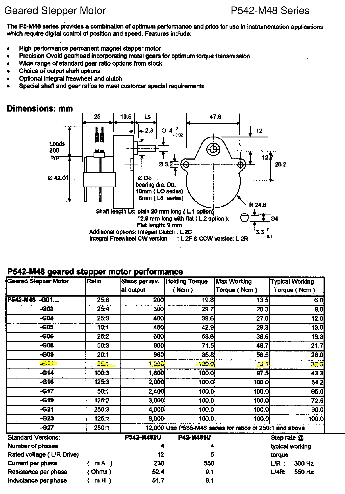
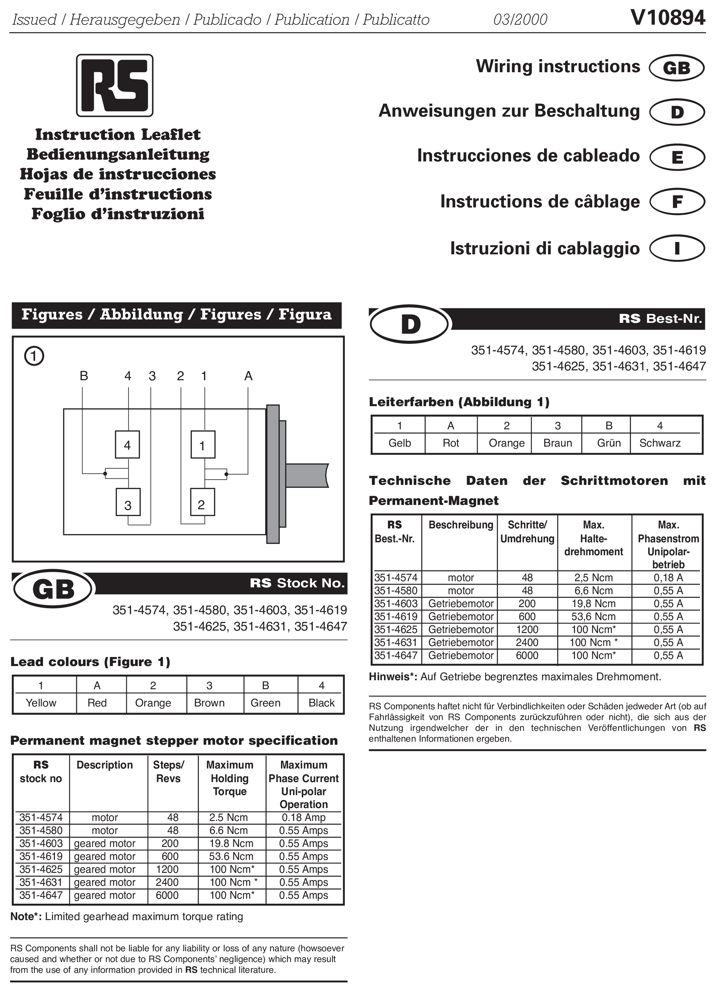

\newpage

# Λειτουργία - Προγραμματισμός tracker. {#trackeroperation}

## Γενικές πληροφορίες

Κατά τη λειτουργία πρέπει να δοθεί προσοχή, διότι δεν υπάρχει μηχανικός περιορισμός που να αποτρέπει την περιστροφή του άξονα κατά γωνίες μεγαλύτερες του πλήρη κύκλου.
Αυτό μπορεί να προκαλέσει πρόβλημα γιατί το καλώδιο του tracker αλλά και τον οργάνων μπορεί να τυλιχτούν γύρω από τον άξονα και να καταστραφούν.
Επίσης, σε περίπτωση που η συσκευή δεν έχει τοποθετηθεί μόνιμα π.χ. σε τρίποδα, μπορεί η περιστροφή να τραβήξει τα καλώδια και να ρίξει τη συσκευή.

Ο tracker όταν του δοθεί εντολή (reset), θα προσπαθήσει να μηδενίσει τον μετρητή βήματος αφού μετακινηθεί σε μία γνωστή θέση.
Αυτό γίνεται με την περιστροφή του άξονα, μέχρι να φτάσει στη συγκεκριμένη θέση, την οποία αναγνωρίζει με μία φωτοδίοδο.
Προσοχή, σε περίπτωση που δεν πάρει σήμα από τη φωτοδίοδο, θα συνεχίσει να περιστρέφεται ασταμάτητα.
Αυτό μπορεί να συμβεί, αν το καπάκι είναι ανοιχτό σε έντονο φως ή αν υπάρχει κάποιο πρόβλημα επικοινωνίας με τη φωτοδίοδο.

Ο tracker θα μηδενίσει τον κάθε άξονα στη θέση `'5000'`. Από εκεί και πέρα μπορεί να κινηθεί και προς τις δύο κατευθύνσεις.
Προσοχή, αν το βήμα γίνει αρνητικό από κάποια εντολή ή αν γίνει μεγαλύτερο του `'9999'` ο tracker θα κολλήσει και θα συνεχίσει να περιστρέφεται ασταμάτητα.
Αυτό πρέπει να αποφευχθεί μέσω του προγραμματισμού του. Μελλοντικά μπορεί να προστεθεί κάποιος μηχανικός ή ηλεκτρικός μηχανισμός περιορισμού.

Εάν το βήμα γίνει ακατάλληλο και ο tracker περιστρέφεται ασταμάτητα, μπορεί να σταματήσει με την εντολή `'stop'`.
Σε αυτήν την περίπτωση, αν ερωτηθεί για τη θέση του επιστρέφει την τιμή `'9999'`.

Όταν ο ηλιοστάτης τροφοδοτείται και είναι σε λειτουργία, οι κινητήρες δεν θα επιτρέψουν την ελεύθερη περιστροφή των αξόνων.
Σε περίπτωση που χρειάζεται να περιστραφούν ελεύθερα, πρέπει να διακοπεί η τροφοδοσία. **Σημείωση**: για το πρώτο/παλιό μοντέλο του ηλιοστάτη (ορθογώνιο παραλληλόγραμμο καπάκι) η αντίσταση των κινητήρων σε εξωτερική περιστροφή είναι πολύ μικρή, με αποτέλεσμα να είναι εύκολη η τυχαία μετατόπισή του από εξωτερικούς παράγοντες.
Σε αυτή την περίπτωση, είναι καλό να γίνει επανεκκίνηση του προγράμματος ελέγχου του tracker, ώστε να ξαναβρεί τη θέση του κάνοντας reset των αξόνων και στην συνέχεια, να ελεγχθεί αν η διόπτευση (sighting) συνεχίζει να είναι σωστή.


## Παράμετροι επικοινωνίας με τον microcontroller του tracker.

Στον Πίνακα \@ref(tab:trackerserial) περιγράφονται οι απαραίτητες παράμετροι για την σύνδεση με τη σειριακή θύρα του tracker. Κατά την επικοινωνία, είναι χρήσιμο να υπάρχει και κάποιο άνω όριο στον χρόνο που περιμένει ο υπολογιστής, πριν αποφασίσει ότι η επικοινωνία δεν είναι εφικτή. Διαφορετικά, αν κάποιο μήνυμα περιμένει να διαβαστεί από τη θύρα και αυτό δεν γίνει, μπορεί να παγώσει η επικοινωνία.

\footnotesize

: (\#tab:trackerserial) Παράμετροι επικοινωνίας του tracker μέσω σειριακής θύρας RS-232.

-------------------------  ----------------------
      **bits per second**  **4800** (baudrate)
            **data bits**  **8** (bytesize)
               **parity**  **none**
            **stop bits**  **1**
          **row control**  **none**
   **timeout** (optional)  90 sec
-------------------------  ----------------------

\normalsize


## Εντολές tracker.

### Μορφή εντολών (format).

Η επικοινωνία με τον microcontroller του tracker γίνεται με εντολές που στέλνονται μέσω σειριακής θύρας επικοινωνίας. Οι εντολές έχουν την μορφή κειμένου 'string' το οποίο τερματίζεται με το σύμβολο `'cr'` ή `'\r'` ('carriage return' το τυπικό 'enter' των MS Windows).

Οι εντολές που έχουν ως όρισμα αριθμό βημάτων, πρέπει να δίνονται με διαμόρφωση τεσσάρων ψηφίων. Όταν είναι αναγκαίο πρέπει να προπορεύονται από τα αντίστοιχα μηδενικά (padded with zero). Για παράδειγμα 1000, 0999, 0099, 0001. Αυτό ισχύει για την απόλυτη θέση (π.χ. `'AZ=0100'`) και για τη σχετική μετατόπιση (`'AZ+0100'`).

Αντίστοιχα, οι εντολές που αφορούν ταχύτητες έχουν την ίδια λογική μόνο που χρησιμοποιούν δύο ψηφία.

**Προσοχή:** Η απάντηση κάθε εντολής (ανάλογα και με τις ρυθμίσεις της σειριακής επικοινωνίας) πρέπει να διαβαστεί από τη σειριακή σύνδεση γιατί διαφορετικά δεν θα αδειάσει το buffer της σειριακής θύρας και μπορεί να παγώσει η επικοινωνία.


### Μηδενισμός του βήματος του microcontroller.

Οι εντολές reset του Πίνακα \@ref(tab:trackercomstr) επιστρέφουν τους κινητήρες στην αρχική τους ('μηδενική') θέση. 
Ο microcontroller αναλαμβάνει την κίνηση. Τους περιστρέφει μέχρι την φωτοδίοδο και εκεί ρυθμίζει το εσωτερικό βήμα κάθε άξονα στη τιμή `5000`. 
Μετά την εκτέλεση της εντολής ο tracker επιστρέφει τη διαφορά στη θέση από τον προηγούμενο μηδενισμό. Αυτές οι εντολές συνήθως χρησιμοποιούνται κατά την εκκίνηση της λειτουργίας ώστε να βεβαιωθούμε για την απόλυτη θέση του tracker, αφού δεν υπάρχει άλλος μηχανισμός αναγνώρισης της θέσης.
Προσοχή, για την σωστή λειτουργία του μηδενισμού, οι παρακάτω εντολές πρέπει να δοθούν ξεχωριστά (όχι σε stack) και να περιμένουμε τον μηδενισμό του κάθε άξονα με την αντίστοιχη απάντηση από τον Tracker προτού δοθεί η επόμενη εντολή. Έπειτα από τον μηδενισμό του κάθε άξονα πρέπει να δοθεί εντολή κίνησης του ίδιου άξονα πριν δοθεί εντολή μηδενισμού του επόμενου άξονα, αλλιώς δημιουργείται πρόβλημα στην επικοινωνία και ο Tracker στην συνέχεια δεν επιστρέφει την απάντηση OK όταν μεταβεί σε κάποια ζητούμενη θέση. Υποθέτοντας ότι η θέση του αζιμούθιου, του ζενίθ και του φίλτρου της φωτοδιόδου είναι 5000, προτείνεται μετά από τον μηδενισμό του κάθε άξονα η κίνηση του ίδιου άξονα στην θέση 5000 (δεν θα μετακινηθεί αφού ήδη βρίσκεται σε αυτήν την θέση, ωστόσο αποφεύγεται το πρόβλημα της επικοινωνίας).

\footnotesize

--------------------------------------------------------------------------------------
    Εντολή          Λειτουργία                    Απάντηση tracker
----------------  ----------------------------  --------------------------------------
  **`DA`**\<cr\>      reset azimuth motor           `eA:####` (όταν βρει τη φωτοδίοδο)

  **`DF`**\<cr\>      reset filters (not used)      `eF:####` (όταν βρει τη φωτοδίοδο)

  **`DZ`**\<cr\>      reset zenith motor            `eZ:####` (όταν βρει τη φωτοδίοδο)
----------------  ----------------------------  --------------------------------------

: (\#tab:trackercomstr) Εντολές μηδενισμού (reset) των αξόνων του tracker.

\normalsize


### Κίνηση των αξόνων.

Η εντολές για την κίνηση των αξόνων έχουν τρία μέρη και έχουν τη γενική μορφή:  **`xx@####<cr>`**. Η εξήγηση των επιμέρους στοιχείων γίνεται στον Πίνακα \@ref(tab:trackercompart) και \@ref(tab:trackercomoper). Παραδείγματα έγκυρων εντολών βρίσκονται στον Πίνακα \@ref(tab:trackercomexamp). Ενώ, το σύνολο των εντολών παρατίθεται στον Πίνακα \@ref(tab:trackercommands).

\footnotesize

------------------------------------------------------------------------
  Παράμετρος  Λειτουργία
------------  ----------------------------------------------------------
  **`xx`**    Η παράμετρος στην οποία αναφέρεται

  `@`         Ο modifier της λειτουργίας που εκτελείται ( ?, =, +, - )

  **`####`**  Αριθμητική τιμή της εντολής (##: για τις ταχύτητες)

  \<cr\>      Ο χαρακτήρας τερματισμού της εντολής.
------------  ----------------------------------------------------------

Table: (\#tab:trackercompart) Τα μέρη της εντολής του tracker.


--------------------------------------------------------------------------------------------------------
 Modifier (@)   Λειτουργία                                                         Απάντηση
--------------  -----------------------------------------------------------------  -----------------------
    **`?`**     Ζητά την τιμή της μεταβλητής από τον tracker (χωρίς `####`)          xx:####\<cr\> ή xx:##\<cr\> για τις παραμέτρους ταχύτητας

    **`=`**     Θέτει την τιμή της μεταβλητής σε αυτήν την τιμή                    OK\<cr\>
                (`##` για τις παραμέτρους ταχύτητας και `####` για τις
                υπόλοιπες παραμέτρους)             

    **`+`**     Αυξάνει την τιμή της μεταβλητής κατά τη δοσμένη τιμή               OK\<cr\>
                (`##` για τις παραμέτρους ταχύτητας και `####` για τις 
                υπόλοιπες παραμέτρους)        

    **`-`**     Μειώνει την τιμή της μεταβλητής κατά τη δοσμένη τιμή               OK\<cr\>
                (`##` για τις παραμέτρους ταχύτητας και `####` για τις
                υπόλοιπες παραμέτρους)       
--------------  -----------------------------------------------------------------  -----------------------

Table: (\#tab:trackercomoper) Παράμετροι ελέγχου (operators/modifiers) εντολών tracker.


---------------------------------------------------------------------------------------------
                 Εντολές  Μέγεθος
------------------------  -------------------------------------------------------------------
   **`AZ@####`**\<cr\>    Αζιμούθιο βήμα

   **ZE@\#\#\#\#**\<cr\>  Ζενίθιο βήμα

   **FR@\#\#\#\#**\<cr\>  Βήμα φίλτρου

       **SA@\#\#**\<cr\>  Ταχύτητα αζιμούθιου άξονα

       **SZ@\#\#**\<cr\>  Ταχύτητα ζενίθιου άξονα

       **SF@\#\#**\<cr\>  Ταχύτητα φίλτρου

   **OA@\#\#\#\#**\<cr\>  Τροποποίηση αρχικής αζιμούθιας θέσης

   **OZ@\#\#\#\#**\<cr\>  Τροποποίηση αρχικής ζενίθιας θέσης

   **OF@\#\#\#\#**\<cr\>  Τροποποίηση αρχικής θέσης φίλτρου

   **IA@\#\#\#\#**\<cr\>  Τροποποίηση της αζιμούθιας θέσης της φωτοδιόδου

   **IZ@\#\#\#\#**\<cr\>  Τροποποίηση της ζενίθιας θέσης της φωτοδιόδου

   **IF@\#\#\#\#**\<cr\>  Τροποποίηση της θέσης του φίλτρου της φωτοδιόδου
   
   **TA@\#\#\#\#**\<cr\>  Τροποποίηση της ζητούμενης αζιμούθιας θέσης (μόνο ερώτηση)

   **TZ@\#\#\#\#**\<cr\>  Τροποποίηση της ζενίθιας αζιμούθιας θέσης (μόνο ερώτηση)

   **TF@\#\#\#\#**\<cr\>  Τροποποίηση της ζητούμενης θέσης του φίλτρου (μόνο ερώτηση)

  **GO XXXX,YYYY**\<cr\>  Μετακινεί ταυτόχρονα την αζιμούθια και ζενίθια θέση σε XXXX και YYYY βήματα αντίστοιχα

          **STOP**\<cr\>  Σταματά την κίνηση του tracker

 **DEBUG ON/OFF**\<cr\>   Toggles debug mode on/off. Στην περίπτωση του ON, ο Tracker επιστρέφει τόσο την εντολή που του δόθηκε, όσο και την αντίστοιχη απάντηση
------------------------  -------------------------------------------------------------------

Table: (\#tab:trackercommands) Εντολές tracker.

\normalsize


Η εντολή **`stop<cr>`** σταματά την κίνηση των αξόνων. Λειτουργεί ακόμα και όταν ο tracker έχει 'κολλήσει'. Όταν δηλαδή, το βήμα κάποιου άξονα έχει φτάσει σε μη επιτρεπτή τιμή. Σε αυτή τη κατάσταση, ο tracker απαντά την τιμή `9999` στο ερώτημα της θέσης, ενώ ο άξονας περιστρέφεται ασταμάτητα.

\footnotesize

--------------------------------------------------------------------------------
   Εντολή              Αποτέλεσμα
---------------------  ---------------------------------------------------------
  **AZ=6000**\<cr\>    Αζιμούθιο στη θέση 6000

  **ZE+0010**\<cr\>    Ζενίθ +10 βήματα

  **AZ-0100**\<cr\>    Αζιμούθιο -100 βήματα

  **AZ?**\<cr\>        Απάντηση: AZ:5900\<cr\>

  **SA=60**\<cr\>      Ταχύτητα του αζιμούθιου άξονα 60

  **?**\<cr\>          θέσεις των δύο αξόνων και του φίλτρου. \
                       Απάντησεις:  AZ:2345\<cr\>,  ZE:5678\<cr\>, FR:3456\<cr\> 
--------------------------------------------------------------------------------

Table: (\#tab:trackercomexamp) Παραδείγματα εντολών tracker.

\normalsize

 
## Reseting USB/serial interface σε GNU/Linux.

Κάποιες ιδέες και προτάσεις για το πως μπορεί να γίνει επανασύνδεση της επικοινωνίας χωρίς να αποσυνδεθεί η φυσική σύνδεση. Έχουν παραχθεί και τα αντίστοιχα 'bash script' που μπορούν να βρουν την κατάλληλη USB συσκευή και να εκτελέσουν τις παρακάτω ενέργειες.


### Αποσύνδεση των αντίστοιχων module/firmware από τον kernel.

Αυτές οι εντολές απενεργοποιούν και ενεργοποιούν τα κομμάτια του συστήματος που χειρίζονται τις σειριακές συσκευές και τις συσκευές USB.

```{bash eval=F}
rmmod  ftdi_sio
rmmod  usbserial
modprobe ftdi_sio
modprobe usbserial
```


### Αποσύνδεση της συσκευής από το σύστημα.

Οι παρακάτω εντολές στέλνουν ένα σήμα σύνδεσης και αποσύνδεσης στην συσκευή USB.

```{bash eval=F}
sudo sh -c "echo 0 > /sys/bus/usb/devices/1-1/authorized"
sudo sh -c "echo 1 > /sys/bus/usb/devices/1-1/authorized"
```


### Αποσύνδεση του mountpoint από το σύστημα (untested).

Αν και δεν έχουν δοκιμαστεί, οι εντολές αυτής της μορφής μπορούν να αποσυνδέσουν και να επανασυνδέσουν την διαδρομή αρχείου που αντιστοιχεί στην συσκευή και επομένως να ανανεώσουν την επικοινωνία.

```{bash eval=F} 
unbind ...
bind   ...
```


    


# Ηλεκτρικά - Μηχανικά Χαρακτηριστικά.

## Κινητήρες tracker (57SH56-4AM)

```{r spmspec, out.width=".94\\linewidth", include=TRUE, echo=FALSE }
system("convert -density 300 ./files/57SH56-4AM_400_STEP.pdf -crop 2300x3390+100+70 -quality 100 ./files/57SH56-4AM_400_STEP.png")
knitr::include_graphics("./files/57SH56-4AM_400_STEP.png")
```


## Κινητήρες filter wheel (G11)


```{r fwspec, out.width="1\\linewidth", include=TRUE, echo=FALSE}
system("convert -density 300 ./files/FWmotor.pdf -crop 2250x3220+120+100 -quality 100 ./files/FWmotor.png")

```

```{r fwwire, out.width="1\\linewidth", include=TRUE, echo=FALSE}
system("convert -density 300 ./files/FWmotor_wiring.pdf -crop 2320x3240+80+70 -quality 100 ./files/FWmotor_wiring.png")

```

## Τροφοδοσία ισχύος

Το τροφοδοτικό του tracker παρέχει συνεχή διαφορά δυναμικού $19-20\ V$. Για την ώρα δεν γνωρίζουμε την δυνατότητα σε ισχύ της συσκευής ούτε φυσικά και το μέγιστο ηλεκτρικό ρεύμα που μπορεί να παρέχει.
