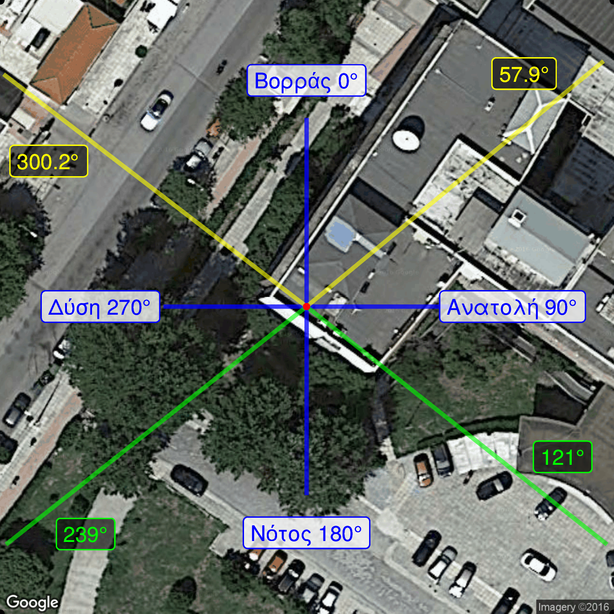

\newpage

# Εγκατάσταση του tracker. {#trackerinstallation}

Είναι αναγκαίο το επίπεδο τις συσκευής να είναι απολύτως οριζόντιο, αλλά και να διατηρείται κατά τη λειτουργία του συστήματος tracker-οργάνου. Γι' αυτό η βάση, πρέπει να είναι αρκετά σταθερή αλλά και να έχει τη δυνατότητα λεπτομερούς ρύθμισης του επιπέδου. Στη συνέχεια θα περιγράψουμε την ρύθμιση του οργάνου για την παρακολούθηση της πορείας του Ήλιου.

```{r trackercompass, echo=F, fig.cap="Δορυφορική φωτογραφία της τοποθεσίας μετρήσεων (κόκκινο). Έχουν σχεδιαστεί οι κατευθύνσεις που αντιστοιχούν στα σημεία του ορίζοντα (μπλε), το αζιμούθιο του ήλιου κατά την ανατολή και τη δύση στις 21 Ιουλίου (κίτρινο) και αντίστοιχα στις 21 Δεκεμβρίου (πράσινο). Όλες οι γωνίες είναι μετρημένες με αρχή την κατεύθυνση του Βορρά.", out.width = '100%', fig.env='img'}

```
<!-- convert -density 300 compass.pdf -shave 204x0 -quality 100 ccc.pdf -->
<!-- convert -density 300 -quality 100 ccc.pdf compass.png -->


## Ρύθμιση αζιμούθιου άξονα.

Πρώτο βήμα, είναι η ευθυγράμμιση του μηδέν του αζιμούθιου της συσκευής με τον Βορρά. Αυτό μπορεί να γίνει με άμεση ευθυγράμμιση, αν η θέση του Βορρά είναι γνωστή (Εικόνα \ref{fig:trackercompass}). Εναλλακτικά, μπορεί να γίνει όταν η συσκευή είναι ενεργή και ακολουθεί τον ήλιο. Τότε, η διόπτευση του ήλιου μπορεί να χρησιμοποιηθεί για να ευθυγραμμίσει το αζιμούθιο με τον Βορρά. Και στις δύο περιπτώσεις η συσκευή πρέπει να τοποθετηθεί στη βάση της και να μπορεί να περιστραφεί πριν σταθεροποιηθεί στην τελική της θέση. Περαιτέρω, βελτίωση της θέσης του μηδενός του αζιμουθιακού άξονα, μπορεί να γίνει προγραμματιστικά, με τις μεταβλητές του offset στο πρόγραμμα που τις ελέγχει.


## Ρύθμιση ζενίθιου άξονα.

Για τον ζενίθιο άξονα, δεν θα χρειαστεί κάποια διαδικασία από τη στιγμή που η συσκευή είναι οριζοντιωμένη. Αν γνωρίζουμε τη θέση αναφοράς όπου μηδενίζει το όργανο, μπορούμε να υπολογίσουμε την θέση που ο άξονας θα βρίσκεται στο ζενίθ ή κάθετα σε αυτό (ανάλογα με τη βάση πρόσδεσης του οργάνου). Έτσι, μπορούμε να θέσουμε αυτήν την παράμετρο στο πρόγραμμα που ελέγχει τη συσκευή. Μία άλλη προσέγγιση, για να βρούμε το offset της στόχευσης, είναι η προσάρτηση του οργάνου να γίνει ενώ ο tracker ακολουθεί τον ήλιο, ώστε να ευθυγραμμιστεί με αυτόν. Αυτό προϋποθέτει ότι η στερέωση του οργάνου μπορεί να γίνει σε οποιαδήποτε γωνία σε σχέση με τον άξονα.


## Οριζοντίωση του ηλιοστάτη (leveling).

Τέλος, έχουμε την καθετοποίηση του οργάνου, ώστε ο άξονας του αζιμούθιου να είναι κατακόρυφος στη Γη. Μετά την τοποθέτηση των οργάνων μέτρησης, αλλά και περιοδικά, η καθετότητα του άξονα πρέπει να ελέγχεται. Καθώς, αποκλίσεις μπορούν να προκαλέσουν εσφαλμένες μετρήσεις κατά τη διάρκεια της ημέρας. Η ανάγκη αυτή, μπορεί να φανεί όταν μετά από διόπτευση (sighting) του Ήλιου, ο tracker χάνει γρήγορα την ευθυγράμμισή του.

Ξεκινάμε με τον tracker χωρίς τροφοδοσία, ώστε να μπορεί να περιστραφεί ελεύθερα γύρω από τον κατακόρυφο άξονα. Για τον έλεγχο της στάθμης χρησιμοποιούμε αλφάδι φυσαλίδας (αεροστάθμη) με δυνατότης ανεξάρτητης ρύθμισης του επιπέδου του σε σχέση με το όργανο, όπως φαίνεται στην Εικόνα \@ref(fig:trackerleveling).


```{r trackerleveling, echo=F, fig.cap="Οριζοντίωση του tracker. Φαίνεται ο tracker εγκατεστημένος σε ρυθμιζόμενη βάση (τρίποδο) και η αεροστάθμη (αλφάδι) με την οποία ελέγχεται η οριζοντίωση.", out.width = '80%', fig.env='img'}
knitr::include_graphics("/home/athan/Aerosols/Photos/EL/20160307_Tracker_CHP1_CCD/P1110530.JPG")
```

Θα ρυθμίσουμε κάθε σημείο ελευθερίας του επιπέδου (εδώ, κάθε πόδι της βάσης) διαδοχικά, μέχρι το επίπεδο του οργάνου να συμφωνεί με το επίπεδο αναφοράς της στάθμης. Σε όλη τη διαδικασία δεν πρέπει να αλλάξουμε τη θέση του οργάνου της στάθμης πάνω στο όργανο.

Η διαδικασία για κάθε πόδι έχει ως εξής:
Φέρνουμε τον άξονα της φυσαλίδας παράλληλο με την διεύθυνση του ποδιού. Αλλάζουμε το ύψος του και ρυθμίζουμε ξανά το όργανο στάθμης, προσπαθώντας να μοιράσουμε την μεταβολή ισόποσα μεταξύ των δύο. Περιστρέφουμε τον tracker κατά $180^\circ$ και επαναλαμβάνουμε τη ρύθμιση και των δύο.

Το παραπάνω βήμα, το επαναλάβουμε μέχρι η στάθμη να είναι ικανοποιητικά επίπεδη. Με τον ίδιο τρόπο ρυθμίζουμε διαδοχικά και τα υπόλοιπα πόδια. Πιθανότατα, θα χρειαστεί παραπάνω από ένας κύκλος ρυθμίσεων και για το κάθε πόδι, αλλά και για τα τρία σε αλληλουχία. Το πλήθος τους, θα εξαρτηθεί από την ευαισθησία του μηχανισμού ρύθμισης, την ικανότητα του χειριστή αλλά και το επιθυμητό επίπεδο ακρίβειας.

Επαναλαμβάνουμε ότι είναι σημαντική η περιστροφή tracker μαζί με όργανο στάθμης κατά $180^\circ$, διότι πρέπει να ληφθεί υπόψη ότι το κάλυμμα του οργάνου δεν είναι κατ' ανάγκη παράλληλο με τη βάση του (π.χ. μπορεί να έχει παραμορφωθεί).

